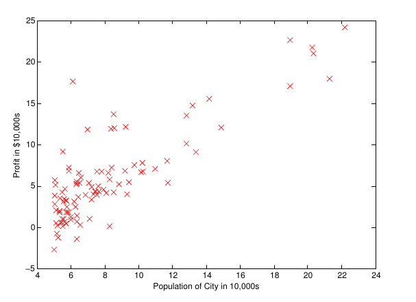

# introduction

Ce tutoriel est une adaptation du cours donnée par Andrew Ng sur le machine Learning pour R.
Il n'est qu'une traduction des exercices proposés sur Octave au logiciel R.
En cela il ne remplace en RIEN les video et conseils de ce cours. Vous devrez visionner ce cours pour comprendre ces différents exercices ;)

## identity matrix

fonction octave 
eye(5) =  identity matrix 5x5

```{r}
A <- diag(5)
class(A)
```


## linear regression with one variable

chargement des données du fichier ex1data1.txt

```{r}
url <- "ex1data1.txt"
# fichier de 2 colonnes séparé par une virgule , séparateur décimaux = . (point)
problem.data <- read.table(url,header = FALSE,sep = ",",dec = ".")
head(problem.data)
```

définition de X (paramètre) et y (variable à prédire)

```{r}
problem.data.X <- problem.data[,1]
problem.data.y <- problem.data[,2]
```

Plot data
Scatter plot of training data

```{r}
# x axis n'a pas le meme interval que l'original
# @todo pour le fun 
plot(problem.data.X,problem.data.y,pch = "+",col = "red",xlab = "Population of City in 10,000s", ylab = "Profit in $10,000s")
# axis(side=1, at=seq(4, 24, by=2))
```


pour comparaison

# Inline



## Gradient descent
fixer les paramètres **$\theta$** pour la regression linéaire en utilisant le 'gradient descent'

```{r}
# traveil avec des matrices pour vectorsation
problem.data.X.matrice <- as.matrix(problem.data.X)
dim(problem.data.X.matrice)
problem.data.y.matrice <- as.matrix(problem.data.y)
dim(problem.data.y.matrice)
problem.data.y.nbre <- NROW(problem.data.y.matrice) # nrow pour un data.frame
```

